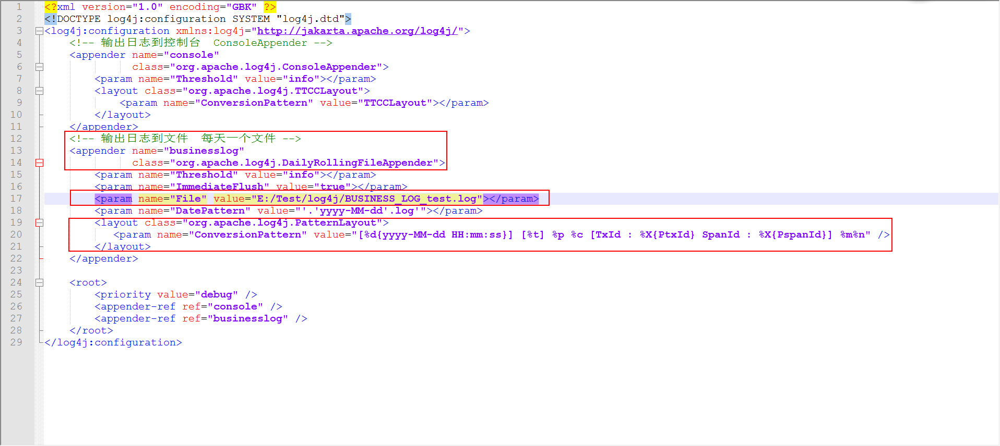
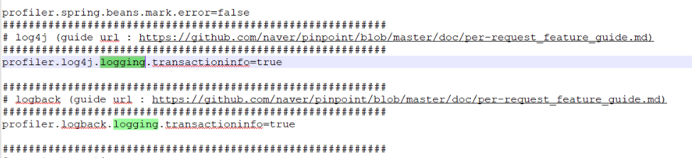
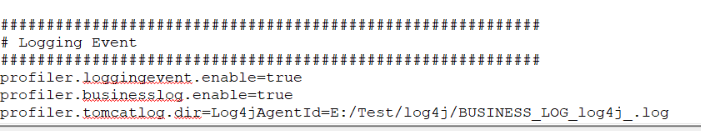
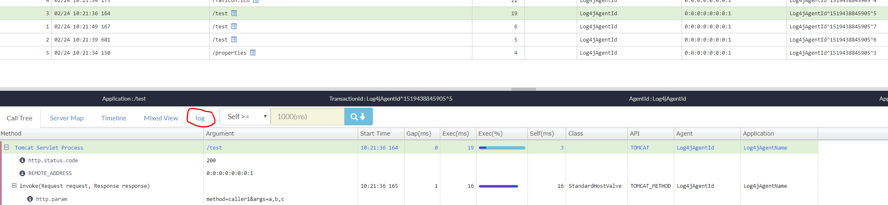
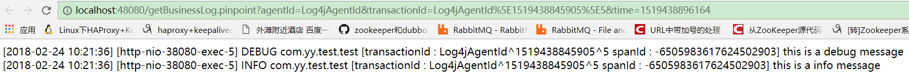

**This is an pre-request example for log4j**
you can follow the instructions below
* **config log4j.xml in the project**
     * **configuration of log4j.xml** - Currently,we have a firm constraint on log4j:*Firstly*,it
     must generate one log per day(daily rolling);*Secondly*,the pattern of logfile'name must match  the Pattern *"^BUSINESS_LOG_[A-Za-z0-9\_-]*.log$"* 
     and in the example, the filename is "BUSINESS_LOG_test.log";*Thirdly*,it must has **exactly** the same log pattern as illustrated
     as follows:
     
* **config pinpoint.config in the pinpoint agent directory**
     1. profiler.log4j.logging.transactioninfo=true
     2. profiler.tomcatlog.dir=AppOneAgentId=E:/Test/log4j/;AppTwoAgentId=D:/Test/log4j
     3. profiler.businesslog.enable=true
       
     
     
     1. The value of *profiler.tomcatlog.dir* is composited of different Application' Info which use the same Pinpoint's agent,for example,
     AppOne and AppTwo are different applications but on the same machine, so they can share the same Pinpoint'agent.Different Application'
     Info must be seperated by **;** .One Application's Info is composited by AgentId and dir of business log which the same with configuration
     in the log4j,but must be a *dir*, and seperated by **=**
     2. Setting profiler.businesslog.enable=true will start the thread of businesslog collector ,or else disable.

     an example configuration of pinpoint.config is as follows:
     

* **how to access the project http address**

for example, we deploy the war pack of the project  in tomcat container at port 8080 and start it, 
then we can visit the url like this : http://localhost:8080/test , if the pinpoint boots normally,
we'll see it in the webui

